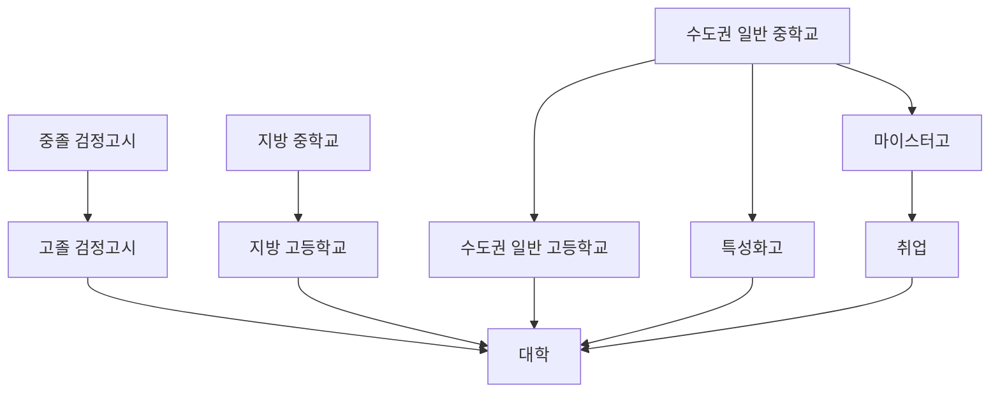

<head>
  
</head>

2026-02-22 작성

<b>mermaid을 이용해 순서도 그리는 방법을 연습한 결과물</b>

```mermaid
flowchart TD
    A[중졸 검정고시] --> B[고졸 검정고시] --> C[대학]
    D[지방 중학교] --> E[지방 고등학교] --> C
    F[수도권 일반 중학교] --> G[수도권 일반 고등학교] --> C
    F --> H[특성화고] --> C
    F --> I[마이스터고] --> J[취업]  --> C
```