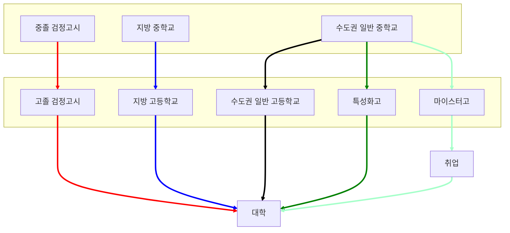
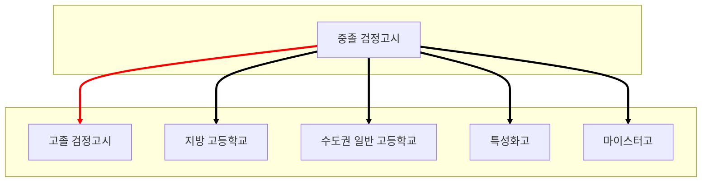
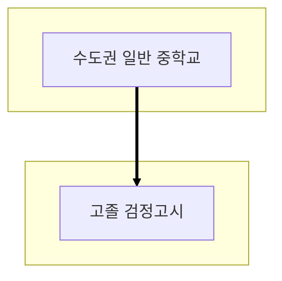

<head>
  
</head>

2026-02-22 작성

검정고시 제도를 이용하면 학생 실력에 따라 중학교 3년과정, 고등학교 3년과정을 단축할수 있는 장점이 있으며, 검정고시 성적이 만점에 가깝다면 정시 뿐 아니라 수시를 통해서 대학진학도 가능하다. 
고졸검정고시로 인한 불이익이 우려된다면 중학교만 검정고시 제도를 이용하고 고등학교는 정규과정을 밟는것도 생각해볼수 있다.

서울, 경기도가 아닌 지방에서 중학교, 고등학교를 졸업할경우 지방대학 및 지역균형인재 육성에 관한 법률에 따라 대학진학 및 취업에 혜택을 받을수 있다.

특성화고나 마이스터고 진학시 좋은 내신성적을 얻는다면 9급공무원이나 공기업 취업시 유리하니 의과대나 명문대 진학을 염두에 두지않고 있다면 충분히 고려할만 하다. 취업 이후에도 이런 학생만을 위한 대학입학전형도 있어 진학의 길도 열려있다.

<i>위 순서도 작성은 <A href="https://mermaid.js.org/">Mermaid</A>를 이용하였다.</i>

